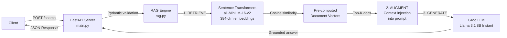

# 🔍 Enterprise Search RAG Demo

> **An AI-native semantic search API built with Retrieval-Augmented Generation (RAG) — designed to demonstrate production-pattern enterprise search engineering.**

[](https://www.python.org/)
[](https://fastapi.tiangolo.com/)
[](https://groq.com/)
[](https://github.com/J4jatin/enterprise-search-rag-demo/actions)
[](https://www.docker.com/)
[](https://opensource.org/licenses/MIT)

---

## 🎯 What this is

Traditional keyword search misses meaning. **Enterprise Search RAG Demo** retrieves documents by _semantic similarity_ (vector embeddings + cosine similarity), then uses an LLM to generate grounded, context-anchored answers.

This mirrors how modern enterprise AI systems — like **SAP Joule** for SAP LeanIX — surface knowledge across an organization's IT landscape, architecture documentation, and operational data.

**The core idea, in three steps:**

1. **Retrieve** — embed the user query, find the top-K semantically similar documents via cosine similarity
2. **Augment** — inject the retrieved documents as grounded context into a carefully engineered prompt
3. **Generate** — call an LLM to produce a precise answer anchored only in the retrieved context

---

## ⚡ Quick Demo

```bash
curl -X POST http://localhost:8000/search \
  -H "Content-Type: application/json" \
  -d '{"question": "How can we reduce cloud costs?", "top_k": 2}'
```

**Sample response:**

```json
{
  "question": "How can we reduce cloud costs?",
  "answer": "Organizations can reduce Azure and AWS expenses by monitoring unused resources and implementing rightsizing strategies...",
  "sources": [
    {
      "title": "Managing Cloud Infrastructure Costs",
      "content": "Organizations can reduce Azure and AWS expenses by monitoring unused resources...",
      "similarity_score": 0.8124
    }
  ],
  "model": "llama-3.1-8b-instant"
}
```

---

## 🏗️ Architecture



### Request Flow

1. Client sends `POST /search` with `{"question": "...", "top_k": 3}`
2. FastAPI validates the request via Pydantic models
3. `search()` encodes the question with Sentence Transformers (384-dim vector)
4. Cosine similarity is computed against pre-computed document vectors (indexed once at startup)
5. Top-K documents are returned ranked by similarity
6. `generate_answer()` builds a context-injected prompt and calls Groq's Llama 3.1 8B
7. Response is returned with answer, sources, similarity scores, and the model used

---

## 🚀 Quick Start

### Prerequisites

- Python 3.12 or later
- A free [Groq API key](https://console.groq.com)

### Local Setup

```bash
# Clone the repo
git clone https://github.com/J4jatin/enterprise-search-rag-demo.git
cd enterprise-search-rag-demo

# Create a virtual environment
python -m venv venv
source venv/bin/activate          # On Windows: venv\Scripts\activate

# Install dependencies
pip install -r requirements.txt

# Configure your Groq API key
cp .env.example .env
# Then edit .env and set: GROQ_API_KEY=your_key_here

# Start the server
uvicorn main:app --reload --host 0.0.0.0 --port 8000
```

The API will be live at `http://localhost:8000`. Visit `http://localhost:8000/docs` for the auto-generated **Swagger UI**.

### Docker

```bash
# Build the image
docker build -t enterprise-search-rag-demo .

# Run with your API key
docker run -p 8000:8000 -e GROQ_API_KEY=your_key_here enterprise-search-rag-demo
```

---

## 📡 API Reference

| Method | Endpoint  | Description                                     |
| ------ | --------- | ----------------------------------------------- |
| GET    | `/`       | Service info and available endpoints            |
| POST   | `/search` | Main RAG search — retrieve + augment + generate |
| GET    | `/health` | Liveness probe for Kubernetes / load balancers  |
| GET    | `/docs`   | Auto-generated Swagger UI                       |
| GET    | `/redoc`  | Alternative API documentation                   |

### POST `/search`

**Request body**

```json
{
  "question": "What are Kubernetes deployment best practices?",
  "top_k": 3
}
```

**Response**

```json
{
  "question": "...",
  "answer": "...",
  "sources": [{ "title": "...", "content": "...", "similarity_score": 0.8421 }],
  "model": "llama-3.1-8b-instant"
}
```

---

## 🧠 How the RAG Pipeline Works

### Stage 1 — Retrieval (Semantic Search)

- The question is encoded to a 384-dim dense vector using `all-MiniLM-L6-v2`
- **Document vectors are pre-computed at startup** — a key performance optimization that eliminates per-query encoding of the corpus
- Cosine similarity is computed between the question vector and all document vectors
- `np.argsort` selects the top-K most similar documents

### Stage 2 — Augmentation (Context Injection)

- Retrieved documents are formatted as a structured context block
- A carefully engineered system prompt instructs the LLM to:
  - Answer **only** from the provided context
  - Acknowledge gaps if the context doesn't contain the answer
  - Avoid hallucination by ignoring outside knowledge

### Stage 3 — Generation

- The augmented prompt is sent to Groq's `llama-3.1-8b-instant`
- `temperature=0.1` for near-deterministic, grounded answers
- `max_tokens=500` to cap response length for cost and UX

---

## 🛠️ Tech Stack

| Layer         | Technology                           | Why this choice                                    |
| ------------- | ------------------------------------ | -------------------------------------------------- |
| Web framework | FastAPI                              | Native async, auto-docs, Pydantic validation       |
| ASGI server   | Uvicorn                              | Production-grade ASGI runtime                      |
| Embeddings    | Sentence Transformers (MiniLM-L6-v2) | 384-dim, fast, great prototype quality             |
| Vector math   | NumPy + scikit-learn                 | Standard, performant, well-documented              |
| LLM           | Groq Llama 3.1 8B Instant            | Fast inference, low cost, generous free tier       |
| Validation    | Pydantic v2                          | Type-safe request and response models              |
| Container     | Docker (python:3.12-slim)            | Lightweight, reproducible deployment               |
| CI/CD         | GitHub Actions                       | Automated import checks + smoke tests on PRs       |
| Secrets       | python-dotenv + .env files           | Standard local pattern; Kubernetes Secrets in prod |

---

## 📁 Project Structure

```
enterprise-search-rag-demo/
├── .github/
│   └── workflows/
│       └── ci.yml            # GitHub Actions CI pipeline
├── documents.py              # In-memory document corpus
├── rag.py                    # Core retrieval + generation logic
├── main.py                   # FastAPI app + endpoints
├── Dockerfile                # Container build (layer-cache optimized)
├── requirements.txt          # Python dependencies
├── .env.example              # Template for secrets
├── .gitignore                # Excludes .env, venv, __pycache__
└── README.md                 # You are here
```

---

## 🎯 Design Decisions

- **Startup-time indexing.** The corpus is embedded once at module load, not per request. This trades a few seconds of startup for sub-100ms query latency.
- **Pre-trained embeddings.** `all-MiniLM-L6-v2` chosen for the balance of speed (384 dims), size (~80MB), and quality. Production candidates: `all-mpnet-base-v2` for higher precision, or a multilingual variant for international enterprises.
- **Groq + Llama 3.1 8B.** Selected for inference speed (Groq's LPU hardware) and cost. Production candidates: Claude, GPT-4o, or a self-hosted LLM for data-sensitive deployments.
- **Strict prompt grounding.** The system prompt explicitly forbids outside knowledge, mitigating hallucination — a critical concern for enterprise search.
- **Container-first.** The Dockerfile uses layer caching (`COPY requirements.txt .` before `COPY . .`) so dependency installs are cached when only code changes.
- **Kubernetes-aware.** `/health` endpoint enables liveness/readiness probes; uvicorn binds to `0.0.0.0` for container networking.

---

## 📊 Performance Characteristics

| Metric                       | Value                             |
| ---------------------------- | --------------------------------- |
| Embedding model load time    | ~2 seconds (one-time at startup)  |
| Corpus indexing              | ~50ms per document (one-time)     |
| Query encoding latency       | ~10–20ms per query                |
| Cosine similarity (5 docs)   | <1ms                              |
| Groq LLM call (avg)          | ~300–500ms                        |
| **End-to-end query latency** | **~500ms typical**                |
| Memory footprint             | ~250MB (model + corpus + runtime) |

> Scale note: brute-force cosine similarity is O(n) per query. For corpora beyond ~10K documents, swap to **Approximate Nearest Neighbour (ANN)** via FAISS, HNSW, or pgvector — see Roadmap.

---

## 🛣️ Roadmap

An honest list of what would make this production-ready:

- [ ] **Chunking strategy** — split long documents into 300–500 token chunks with overlap before embedding
- [ ] **Vector database** — migrate from in-memory NumPy to `pgvector` or `Weaviate` for persistence and scale
- [ ] **Approximate Nearest Neighbour (ANN)** — HNSW indexing for sub-linear query time at 1M+ docs
- [ ] **Cross-encoder reranker** — post-retrieval reranking with a slower but more accurate model (e.g. `bge-reranker-base`) for higher precision
- [ ] **Hybrid retrieval** — combine sparse (BM25) and dense vector search for the best of both worlds
- [ ] **Unit & integration tests** — pytest suite covering `search()`, `generate_answer()`, and end-to-end via FastAPI's `TestClient`
- [ ] **Async endpoints** — convert `/search` to `async def` + async Groq client for higher concurrency
- [ ] **Pinned dependencies** — adopt Poetry or pip-tools for lockfile-based dependency management
- [ ] **Non-root container user** — add `USER appuser` for tighter container security
- [ ] **Observability** — structured JSON logging, OpenTelemetry traces, Prometheus metrics

---

## 🧪 Known Limitations

This is an intentional prototype — being upfront about what's not yet production-ready:

- **No unit tests yet** — CI currently only checks imports and the health endpoint
- **Dependencies not pinned to exact versions** — `pip freeze` lockfile is the next step
- **In-memory document store** — sample docs are hard-coded; no persistence layer
- **No chunking** — long documents would be embedded as a single vector, losing local detail
- **Brute-force similarity** — O(n) per query; doesn't scale beyond a few thousand documents
- **No rate limiting, auth, or CORS configuration** — needed for any real deployment
- **Container runs as root** — should add a non-root user

These are _known_ gaps, listed deliberately. The roadmap above is the prioritized fix list.

---

## 👤 About the Author

**Jattin Shah** — MSc Applied AI student at **TU Dresden**.

Passionate about search systems and AI-native architectures. This project was built to explore production-pattern RAG engineering — semantic retrieval, prompt engineering, grounded generation, container deployment, and CI/CD — in a single focused codebase.

- GitHub: [@J4jatin](https://github.com/J4jatin)
- LinkedIn: [jattin-shah](https://linkedin.com/in/jattin-shah)

---

## 📄 License

MIT License — feel free to use, learn from, and adapt.

---

_Built with curiosity, deliberately scoped, and engineered with the patterns that matter at enterprise scale._
